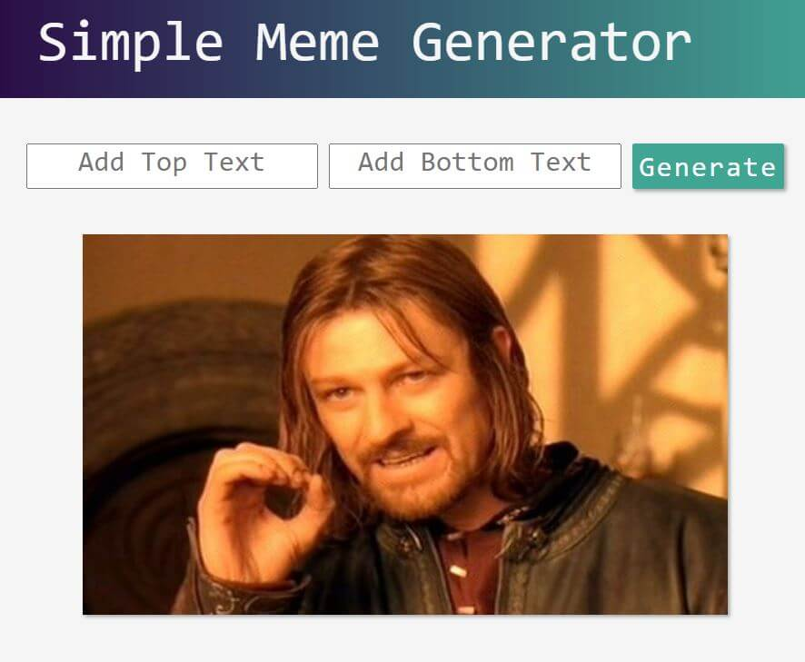

# Meme Generator
<table>
<tr>
<td>
  A simple meme-generator built using React.Js library. There user self can add top and bottom text on the picture and by pressing 'Generate' button, meme is randomly generated.
</td>
</tr>
</table>

# 

## Website 

Here is a working [Meme-Generator](https://laura.jaks.info/meme-generator/).

## Built with 

- [Create React App](https://github.com/facebook/create-react-app) - simplified tool when building React apps.
- [The Imgflip API](https://api.imgflip.com/) - provides an array of popular memes with this API.

## To-do
- Add `save` button to save generated meme.